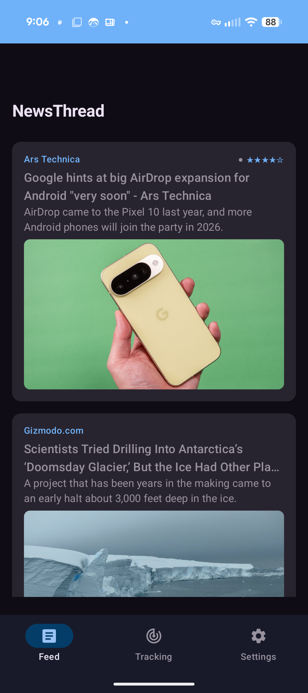
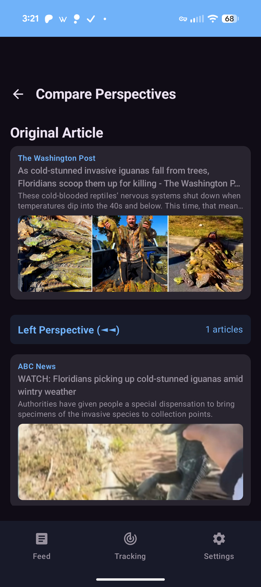

# NewsThread 🧵

**Follow the thread of every story**

> [!IMPORTANT]
> **Sign up at [NewsThread.io](https://newsthread.io)** to be notified when the app officially launches!

A native Android news reader that shows how different media sources cover the same story, plotted along a political bias spectrum. Built with an offline-first, privacy-first design, and all processing happens on your device.

---

## What Makes NewsThread Different ✨

### Bias-Aware News Reading ⚖️
- **Integrated bias ratings** on every article from three respected organizations
- Visual indicators showing Left (◄◄), Center-Left (◄), Center (●), Center-Right (►), Right (►►)
- Reliability ratings (1-5 stars) from trusted fact-checking organizations
- 50+ major news sources rated and categorized

### Perspective Comparison 🔍
Compare how sources across the political spectrum cover the same story. Inspired by Google News "Full Coverage" but with a bias transparency layer — articles are plotted along a continuous left-to-right spectrum so you can see where each source falls.

### On-Device NLP Matching 🧠
The matching engine uses TensorFlow Lite sentence embeddings running entirely on your device. No backend server, no data leaves your phone. The app extracts article text, generates semantic embeddings (384-dimensional vectors), and finds genuinely related stories — replacing keyword-based matching with real semantic understanding.

### Privacy-First Design 🛡️
- All processing happens on-device (no backend server)
- No tracking, no ads, no data selling
- Works offline with cached articles
- Future: data backed up to your own Google Drive

---

## Current Status 🚀

**Version**: 0.5.1 (Alpha)
**Status**: Active Development

### Completed

- [x] Clean Architecture setup (MVVM, Repository pattern, Hilt DI)
- [x] Bottom navigation (Feed, Tracking, Settings)
- [x] NewsAPI integration for live headlines
- [x] Room database with source ratings system
- [x] Article feed with images, summaries, and source info
- [x] Bias rating system (50 sources from AllSides, Ad Fontes, MBFC)
- [x] Bias symbols (◄◄ ◄ ● ► ►►) and reliability stars on every article
- [x] Article detail view with in-app WebView reader
- [x] Semantic article matching (Phase 4 integration)
- [x] UI pipeline orchestration and matching hints (Phase 5)
- [x] Background processing and sync settings (Phase 6)

<details>
<summary><b>Phase 1: Foundation (Completed 2026-02-02)</b></summary>

- [x] Room cache tables for articles, embeddings, and match results
- [x] Feed response caching with 3-hour TTL
- [x] Offline-first NewsRepository (Room as source of truth)
- [x] NewsAPI 429 rate limit detection with graceful degradation
- [x] User feedback when rate limited (Snackbar with time remaining)
- [x] OkHttp 50 MiB HTTP cache with custom interceptors
- [x] DataStore persistence for quota state across app restarts
- [x] Embedding storage utilities (FloatArray ↔ ByteArray conversion)
</details>

<details>
<summary><b>Phase 2: Text Extraction (Completed 2026-02-05) ✅ Verified</b></summary>

- [x] Readability4J 1.0.8 and jsoup 1.22.1 dependencies
- [x] ExtractionResult sealed class (Success, PaywallDetected, NetworkError, ExtractionError, NotFetched)
- [x] ArticleFetchPreference enum (ALWAYS, WIFI_ONLY, NEVER)
- [x] PaywallDetector with 3-tier detection (structured data, CSS selectors, text patterns)
- [x] ArticleHtmlFetcher with 100 MiB cache and 7-day TTL
- [x] NetworkMonitor for WiFi/metered network detection
- [x] UserPreferencesRepository for DataStore persistence
- [x] TextExtractionRepository orchestrating fetch → paywall → parse → save pipeline
- [x] Retry-once extraction logic with 5-minute window
- [x] Database migration v2→v3 (extraction failure tracking columns)
- [x] Settings UI for article fetch preference (SettingsViewModel, radio buttons)
</details>

<details>
<summary><b>Phase 3: Embedding Engine (Completed 2026-02-06) ✅ Verified</b></summary>

- [x] TensorFlow Lite 2.17.0 integration with XNNPACK optimization (16KB aligned)
- [x] all-MiniLM-L6-v2 quantized INT8 model (~23MB) bundled in assets
- [x] BertTokenizerWrapper with 30,522 token vocabulary (WordPiece)
- [x] EmbeddingModelManager with lazy loading and thread-safe inference
- [x] EmbeddingRepository with caching, retry logic, and failure tracking
- [x] Runtime tensor resizing fix for dynamic input shapes
- [x] 384-dimensional embeddings with L2 normalization
</details>

<details>
<summary><b>Phase 4: Similarity Matching (Completed 2026-02-06) ✅ Verified</b></summary>

- [x] SimilarityMatcher for cosine similarity (STRONG ≥0.70, WEAK ≥0.50)
- [x] TimeWindowCalculator for dynamic search windows (±48h to ±14d)
- [x] Tiered matching: Feed-internal first → NewsAPI search fallback
- [x] Persistent similarity scores in MatchResultEntity
- [x] "Unrated Perspectives" support for unknown sources
- [x] Mockito integration for high-fidelity repository unit tests
- [x] **Verification**: 9/9 logic tests passed (100% logic coverage)
</details>
 
<details>
<summary><b>Phase 5: Pipeline Integration (Completed 2026-02-06) ✅ Verified</b></summary>
 
- [x] Introduced `GetSimilarArticlesUseCase` for "Fetch → Embed → Match" orchestration
- [x] Added `matchMethod` persistence and state propagation
- [x] Implemented user fallback hint: *"Perspectives are limited. Connect to WiFi for more perspectives."*
- [x] Created `ComparisonHint` UI component for contextual feedback
- [x] Verified end-to-end flow with unit tests for UseCase orchestration
</details>

<details>
<summary><b>Phase 6: Background Processing (Completed 2026-02-07) ✅ Verified</b></summary>

- [x] WorkManager infrastructure with Hilt injection and custom Configuration
- [x] `ArticleAnalysisWorker` for background pre-computation of top 20 articles
- [x] `BackgroundWorkScheduler` observing user preferences (Sync Enabled, Strategy, Metered)
- [x] Settings UI with "Performance", "Balanced", "Power Saver" strategies
- [x] Data usage warnings for metered network syncing
</details>

<details>
<summary><b>Phase 7: UI Implementation (Completed 2026-02-07) ✅ Verified</b></summary>

- [x] Bias Spectrum Rail (Canvas visualization)
- [x] Reliability Badges (Accessible shields with shape+color)
- [x] Comparison Screen integration with "Related Stories"
- [x] Settings legend for ratings and reliability
</details>

### In Development — Story Tracking (Phases 8-10)

The matching engine rebuild is complete. We are now building the Story Tracking feature:

| Phase | Name | Status | What It Does |
|-------|------|--------|-------------|
| 1 | Foundation | ✅ **Complete** | Data models, Room schema, caching, rate limiting |
| 2 | Text Extraction | ✅ **Complete** | Fetch and parse full article text from URLs |
| 3 | Embedding Engine | ✅ **Complete** | On-device TF Lite sentence embeddings (384-dim) |
| 4 | Similarity Matching | ✅ **Complete** | Cosine similarity, clustering, persistent scores |
| 5 | Pipeline Integration | ✅ **Complete** | End-to-end matching orchestration in UI |
| 6 | Background Processing | ✅ **Complete** | WorkManager pre-computation during idle |
| 7 | UI Implementation | ✅ **Complete** | Bias spectrum visualization |
| 8 | Tracking Foundation | 📋 **Next** | Database & UI for followed stories |
| 9 | Story Grouping Logic | 📅 Planned | Auto-grouping new articles to threads |
| 10 | Notifications | 📅 Planned | Background alerts for thread updates |

**Progress:** Phase 1-7 complete — 100% of matching engine milestone complete. Starting **Story Tracking** milestone (Phase 8-10).

**26 requirements** defined across matching engine, bias spectrum UI, caching, and infrastructure.

### Planned (Future Milestones)

- [ ] ⏳ Timeline visualization — see the evolution of a story
- [ ] 🔑 Google Sign-In and Google Drive backup
- [ ] 📊 Reading analytics — track your bias exposure
- [ ] ⚠️ Filter bubble warnings when habits become one-sided
- [ ] 🖱️ Interactive bias spectrum (tap/drag to filter)

---

## Key Technical Decisions ⚙️

| Decision | Rationale |
|----------|-----------|
| 🔒 **On-device NLP only** | Privacy-first — all data stays on your device |
| 🤖 **TF Lite with all-MiniLM-L6-v2** | 2.17.0+ quantized model for 16KB alignment |
| ⚡ **Pre-compute matches** | Results ready before user taps Compare |
| 🎨 **Bias spectrum UI** | Continuous axis is more nuanced than buckets |
| ✂️ **Readability4J + JSoup** | Parse article body from URLs with fallback |
| 📐 **In-memory cosine similarity** | Fast and lightweight for mobile |
| 📶 **User-controlled fetching** | WiFi-only / always / never setting |
| 🧱 **16KB Page Alignment** | Android 15 compatibility |

---

## Architecture 🏗️

### Clean Architecture Layers

```
presentation/         # UI layer (Jetpack Compose)
├── feed/             # News feed with bias ratings
├── detail/           # Article detail WebView
├── comparison/       # Perspective comparison (bias spectrum)
├── tracking/         # Story tracking (future)
├── settings/         # App settings
└── theme/            # Material 3 theming

domain/               # Business logic (pure Kotlin)
├── model/            # Domain models (Article, SourceRating, etc.)
├── usecase/          # Business logic use cases
└── repository/       # Repository interfaces

data/                 # Data layer
├── local/            # Room database, DAOs, entities
├── remote/           # Retrofit API, DTOs
└── repository/       # Repository implementations

di/                   # Hilt dependency injection modules
util/                 # Utilities (DatabaseSeeder, etc.)
```

### Tech Stack

- **UI**: Jetpack Compose with Material Design 3
- **Architecture**: MVVM + Clean Architecture
- **DI**: Hilt (Dagger)
- **Database**: Room (SQLite) with proper migrations
- **Networking**: Retrofit + OkHttp with caching
- **Image Loading**: Coil
- **Async**: Kotlin Coroutines + Flow
- **Navigation**: Jetpack Navigation Compose
- **ML**: TensorFlow Lite with all-MiniLM-L6-v2 for on-device sentence embeddings
- **Text Extraction**: Readability4J + JSoup
- **Background**: WorkManager with Hilt integration
 
### Tooling & AI-Augmentation 🤖

NewsThread was built using a hybrid AI-augmented workflow, moving from foundational boilerplate to complex architectural engineering.

* **[Android Studio](https://developer.android.com/studio)** — The primary forge for development.
* **[Antigravity](https://antigravity.google/)** — The agentic partner for complex phases (Orchestration, on-device NLP, and 16KB system fixes).
* **[Claude Code](https://claude.ai/code)** — The foundational spark used for initial prototyping and Phase 1-2 UI/Repository boilerplate.
* **[GSD (Getting Shit Done)](https://github.com/glittercowboy/get-shit-done)** — The workflow framework providing structured research, planning, and execution cycles.
* **[Beads](https://github.com/steveyegge/beads)** — Local system management and daemon integration.
 
### Matching Pipeline (In Development)

```
Article Feed
  → Text Extraction (fetch URL + parse with Readability4J)
  → Embedding Generation (TF Lite sentence embeddings)
  → Similarity Matching (cosine similarity, configurable threshold)
  → Bias Clustering (join with source ratings)
  → Bias Spectrum UI (continuous left-to-right visualization)
```

---

## Source Bias Rating System 📊

> **Disclaimer**
>
> Bias ratings are provided for **informational and educational purposes only**. These ratings aggregate data from third-party organizations and represent general consensus, not absolute truth. Individual articles may vary from a source's overall rating. We encourage reading from multiple sources and thinking critically.

NewsThread uses a **consensus approach** combining three respected media bias organizations:

### Rating Sources
1. **AllSides** — Community-driven bias ratings
2. **Ad Fontes Media** — Interactive Media Bias Chart
3. **Media Bias/Fact Check** — Detailed factual reporting analysis

### Bias Scale
- **-2 (◄◄)**: Left — CNN, MSNBC, HuffPost
- **-1 (◄)**: Center-Left — NPR, Washington Post, Politico
- **0 (●)**: Center — Reuters, AP, BBC, The Hill
- **+1 (►)**: Center-Right — WSJ (news), The Economist
- **+2 (►►)**: Right — Fox News, Breitbart, Newsmax
- **?**: **Unrated Perspectives** — Sources not yet rated appear with a queston mark; they are still matched and clustered, but without a bias position.

### Reliability Scale (1-5 stars)
- **★★★★★**: Very High — Reuters, AP, BBC
- **★★★★☆**: High — NPR, WSJ, Washington Post
- **★★★☆☆**: Mostly Factual — CNN, Fox News
- **★★☆☆☆**: Mixed — Opinion sites, partisan sources
- **★☆☆☆☆**: Low — Conspiracy sites, misinformation

50+ sources rated including CNN, Fox News, MSNBC, Reuters, AP, BBC, NPR, New York Times, Washington Post, Wall Street Journal, The Guardian, Politico, The Hill, Bloomberg, and more.

---

## Getting Started 🛠️

### Prerequisites
- Android Studio Hedgehog or newer
- Android SDK 34
- Kotlin 1.9+
- NewsAPI key ([newsapi.org](https://newsapi.org))

### Setup

1. **Clone the repository**
   ```bash
   git clone https://github.com/lweiss01/news-thread.git
   cd news-thread
   ```

2. **Add API key**
   Create `secrets.properties` in the project root:
   ```
   NEWS_API_KEY=your_key_here
   ```

3. **Build and run**
   ```bash
   gradlew assembleDebug
   ```
   Or open in Android Studio, sync Gradle, and run on emulator or device.

---

## Screenshots 📸
 
<table>
  <tr>
    <td width="33%" align="center">
      
      <br><b>News Feed v0.5</b><br>
      Real-time headlines with aggregated bias indicators.
    </td>
    <td width="33%" align="center">
      
      <br><b>Perspective spectrum</b><br>
      Semantic clustering of stories along a political axis.
    </td>
    <td width="33%" align="center">
      
      <br><b>The 16KB Villain</b><br>
      The Android 15 error we officially conquered.
    </td>
  </tr>
</table>

---

## Configuration

- **Min SDK**: 26 (Android 8.0)
- **Target SDK**: 34 (Android 14)
- **Java**: 17
- **Kotlin**: 1.9.22

Firebase requires a valid `google-services.json` in `app/` (not committed to git).

---

## Contributing

Not yet accepting contributions as this is early-stage development. Check back later!

---

## License

Copyright 2026 NewsThread. All rights reserved.

---

## About

Built by a senior information security data analyst who believes we need better tools to navigate today's complex media landscape. NewsThread helps people read news from diverse perspectives and understand the full story.

**Links:**
- **Repository**: https://github.com/lweiss01/news-thread
- **Issues**: https://github.com/lweiss01/news-thread/issues

---

**[Join the Waitlist](https://newsthread.io)** — Be the first to know when the app launches.

---

**"Follow the thread of every story"**
