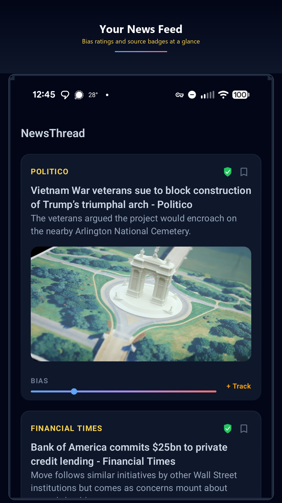
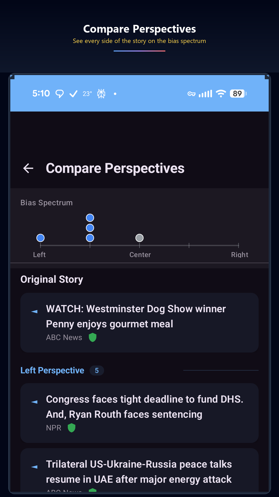
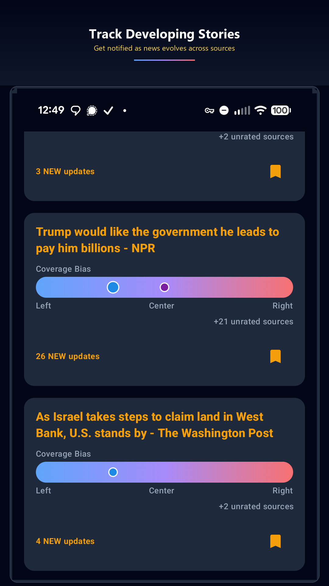
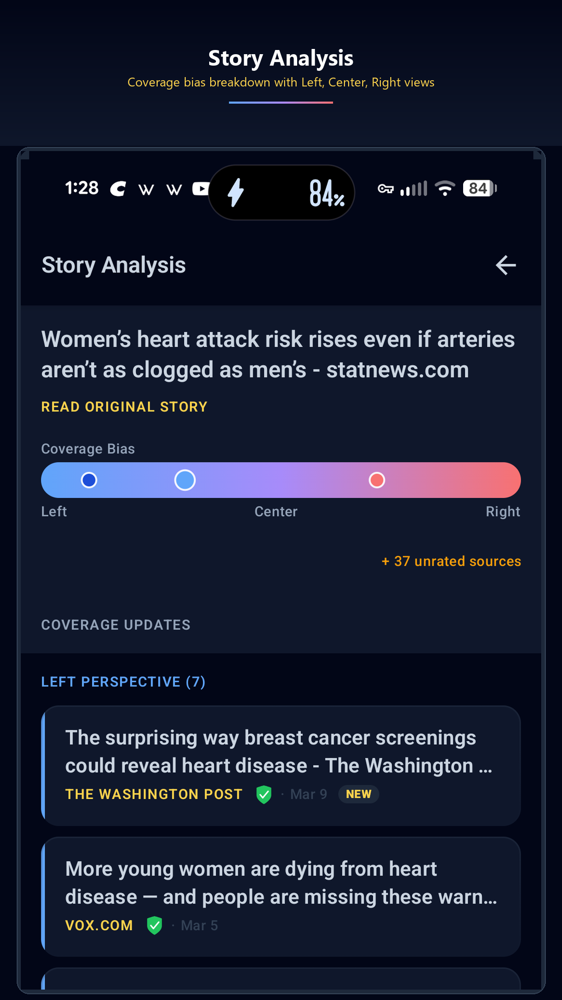
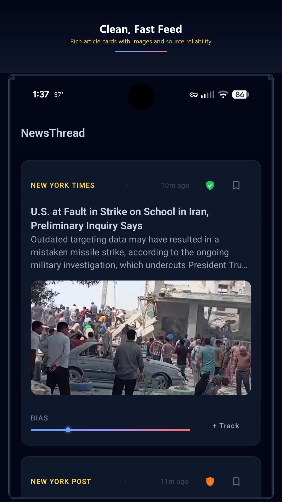
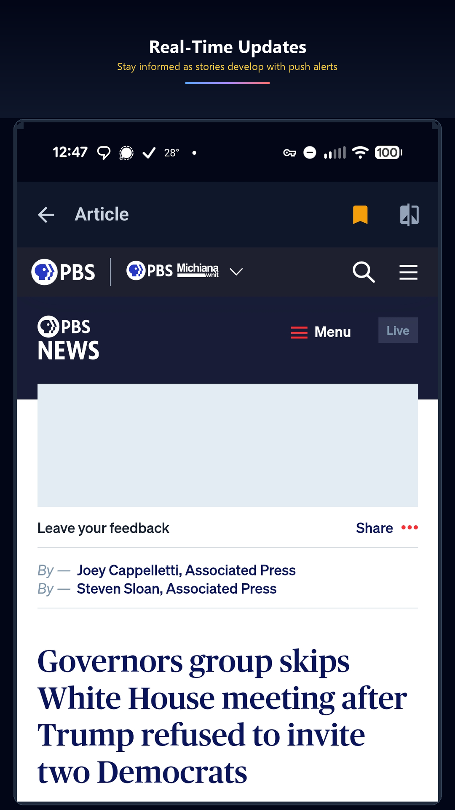
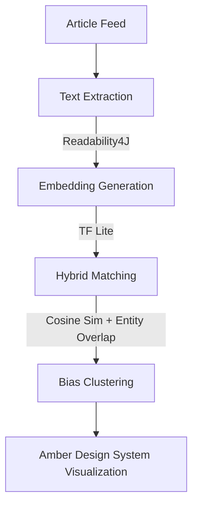

# NewsThread 🧵

**Follow the thread of every story**

> [!IMPORTANT]
> **Sign up at [NewsThread.io](https://newsthread.io)** to be notified when the app officially launches!

A native Android news reader that shows how different media sources cover the same story, plotted along a political bias spectrum. Built with an offline-first, privacy-first design: feed aggregation runs through a Cloudflare Worker, while semantic matching and clustering run on-device.

---

## What Makes NewsThread Different ✨

### Bias-Aware News Reading ⚖️
- **Integrated bias ratings** on every article from three respected organizations
- **Bias heatmap bar** with colored dots showing where each source falls on the spectrum
- Reliability ratings (1–5 stars) from trusted fact-checking organizations
- **150+ major news sources** rated and categorized

### Perspective Comparison 🔍
Compare how sources across the political spectrum cover the same story. Inspired by Google News "Full Coverage" but with a bias transparency layer: articles are plotted along a continuous left-to-right spectrum so you can see where each source falls.

### On-Device NLP Matching 🧠
The matching engine uses TensorFlow Lite sentence embeddings running entirely on your device. Feed retrieval and URL resolution are handled by a Cloudflare Worker, while embedding generation and similarity matching run locally. The app extracts article text, generates semantic embeddings (384-dimensional vectors), and finds genuinely related stories — replacing keyword-based matching with real semantic understanding.

### Privacy-First Design 🛡️
- Personalization, embedding generation, and similarity matching run on-device
- No tracking, no ads, no data selling
- Works offline with cached articles
- Future: data backed up to your own Google Drive

---

## Screenshots 📸

<table>
  <tr>
    <td width="33%" align="center">
      
      <br><b>News Feed</b><br>
      Live headlines with bias ratings, reliability stars, and OG images.
    </td>
    <td width="33%" align="center">
      
      <br><b>Bias Spectrum</b><br>
      See how sources cover the same story across the political spectrum.
    </td>
    <td width="33%" align="center">
      
      <br><b>Story Tracking</b><br>
      Follow developing stories with auto-clustered updates and bias heatmaps.
    </td>
  </tr>
  <tr>
    <td width="33%" align="center">
      
      <br><b>Story Analysis</b><br>
      Full coverage breakdown: Left, Center, and Right perspectives side by side.
    </td>
    <td width="33%" align="center">
      
      <br><b>Clean Feed</b><br>
      Modern dark interface designed for reading. Pull to refresh for the latest.
    </td>
    <td width="33%" align="center">
      
      <br><b>Live Updates</b><br>
      Get notified when tracked stories receive new coverage.
    </td>
  </tr>
</table>

---

## Current Status 🚀

**Version**: 1.2.0  
**Milestone**: v1.2 Google Play Release  
**Progress**: 23 of 24 slices complete — finalizing quality and onboarding

### What's Built

| | Feature | Status |
|---|---------|--------|
| 📰 | **News Feed** — Live headlines with bias ratings and reliability stars | ✅ |
| 🧠 | **On-Device NLP** — TF Lite sentence embeddings for semantic article matching | ✅ |
| ⚖️ | **Bias Spectrum** — Articles plotted on a continuous left-to-right political axis | ✅ |
| 📌 | **Story Tracking** — Follow developing stories with auto-clustered threads | ✅ |
| 🔔 | **Notifications** — Background alerts when tracked stories get new coverage | ✅ |
| 🎨 | **Amber Design System** — Consistent design tokens and polished UI | ✅ |
| 🔄 | **Discovery Engine** — Background loop builds a 70+ story feed across categories | ✅ |
| 🛡️ | **Authenticated Quality** — Strict filtering ensures 100% rated sources | ✅ |
| 📖 | **Text Extraction** — Full article body parsed via Readability4J + JSoup | ✅ |
| 🌐 | **Cloudflare Edge Backend** — Stateless RSS proxy, no user data, no API keys | ✅ |
| 🖼️ | **Store Assets** — App icon, feature graphic, 6 framed screenshots, listing copy | ✅ |
| 🧹 | **Code Review Fixes** — FeedViewModel UseCase refactor, 10 UI bugs closed | ✅ |
| 🔧 | **Release Infrastructure** — Signing, ProGuard, privacy policy, legal links | ✅ |
| 🎓 | **Quality & Onboarding** — First-launch UX, final regression | 🔜 Next |

### What's Next

| Slice | Focus | Status |
|-------|-------|--------|
| S23 | **Release Infrastructure** — signing config, R8/ProGuard rules, privacy policy, legal links | ✅ Complete |
| S24 | **Quality & Onboarding** — first-launch experience, regression testing, release verification | Planned |

### Future Milestones (Post-Launch)

- ⏳ Timeline visualization — see how a story evolves hour by hour
- 🔑 Google Sign-In and Google Drive backup
- 📊 Reading analytics — understand your own media diet
- ⚠️ Filter bubble warnings when your reading habits skew one-sided
- 🖱️ Interactive bias spectrum (tap to filter by political lean)

---

## The Cloudflare RSS Engine 🌐 ⚡

NewsThread runs on a free, unlimited feed system powered by a Cloudflare Edge Worker — no user-provided API keys, no rate limits, no per-user quotas.

**Layer 1 — Google News RSS (Discovery & Volume)**  
Google News RSS feeds are polled for trending stories. A Continuous Discovery loop background-polls categories like World, Technology, Science, Health, and Business to build a 70+ story feed on every refresh.

**Layer 2 — Direct Outlet Feeds (Depth)**  
Dozens of handpicked outlets are polled directly via RSS. NewsThread's ratings dataset covers 150+ sources mapped by bias and reliability.

| Bias | Examples |
|------|----------|
| Left | MSNBC, The Guardian, The Atlantic, Vox, Slate, HuffPost |
| Lean Left | CNN, NYT, NPR, Washington Post, NBC, ABC, CBS, Politico |
| Center | AP, Reuters, BBC, The Hill, PBS NewsHour, AllSides |
| Lean Right | WSJ, Fox News, Washington Examiner, National Review |
| Right | Breitbart, The Daily Wire, The Federalist, Newsmax, OAN |

The Worker resolves Google News redirect links server-side, caches via Cloudflare KV, and standardizes feed parsing. It is fully stateless — no concept of users, no personal data, same cached response for everyone. Reading history, tracked stories, and preferences never leave the device.

---

## Key Technical Decisions ⚙️

| Decision | Rationale |
|----------|-----------|
| 🔒 **On-device NLP only** | Privacy-first — all data stays on your device |
| 🌐 **Layered RSS Engine** | Google News for discovery + direct feeds for depth — free and unlimited |
| 🛡️ **Authenticated Quality** | Only rated sources reach the main feed |
| 🤖 **TF Lite all-MiniLM-L6-v2** | Quantized 384-dim model, 16KB page alignment for Android 15 |
| ⚡ **Pre-compute matches** | Results ready before user taps Compare |
| 🎨 **Bias spectrum UI** | Continuous axis is more nuanced than Left/Center/Right buckets |
| ✂️ **Readability4J + JSoup** | Parse article body from URLs with fallback |
| 📐 **In-memory cosine similarity** | Fast and lightweight for mobile |
| 🏗️ **Clean Architecture + UseCases** | Domain layer owns business logic; ViewModels depend only on UseCases |

---

## Architecture 🏗️

### Clean Architecture Layers

```
presentation/         # UI layer (Jetpack Compose)
├── feed/             # News feed with bias ratings
├── detail/           # Article detail WebView
├── comparison/       # Perspective comparison (bias spectrum)
├── tracking/         # Story tracking & thread management
├── story/            # Story detail view
├── components/       # Shared UI components (BiasHeatmap, etc.)
├── navigation/       # Bottom nav bar & route definitions
├── settings/         # App settings
└── theme/            # Material 3 theming (Amber design system)

domain/               # Business logic (pure Kotlin)
├── model/            # Domain models (Article, SourceRating, etc.)
├── usecase/          # GetFeedUseCase, ToggleFollowUseCase, etc.
├── similarity/       # EntityExtractor, embedding comparison
└── repository/       # Repository interfaces

data/                 # Data layer
├── local/            # Room database, DAOs, entities
├── remote/           # Worker/feed + HTML fetch clients
└── repository/       # Repository implementations

di/                   # Hilt dependency injection modules
util/                 # Utilities (DatabaseSeeder, etc.)
```

### Tech Stack

| Layer | Technology |
|-------|-----------|
| **UI** | Jetpack Compose + Material Design 3 |
| **Architecture** | MVVM + Clean Architecture |
| **DI** | Hilt (Dagger) |
| **Database** | Room (SQLite) with migrations |
| **Networking** | OkHttp with caching |
| **Image Loading** | Coil + OG image resolution |
| **Async** | Kotlin Coroutines + Flow |
| **Navigation** | Jetpack Navigation Compose |
| **ML** | TensorFlow Lite — all-MiniLM-L6-v2 (384-dim sentence embeddings) |
| **Text Extraction** | Readability4J + JSoup |
| **Background** | WorkManager with Hilt integration |
| **Edge Backend** | Cloudflare Workers + KV cache |

### Matching Pipeline


```mermaid
graph TD
    A[Article Feed] --> B[Text Extraction]
    B -->|Readability4J| C[Embedding Generation]
    C -->|TF Lite| D[Hybrid Matching]
    D -->|Cosine Sim + Entity Overlap| E[Bias Clustering]
    E --> F[Amber Design System Visualization]
```

### Tooling & AI-Augmentation 🤖

NewsThread was built using a hybrid AI-augmented workflow:

* **[Android Studio](https://developer.android.com/studio)** — Primary IDE
* **[Antigravity](https://antigravity.google/)** — Agentic partner for on-device NLP, orchestration, and system fixes
* **[Claude Code](https://claude.ai/code)** — Foundational prototyping, UI/repository boilerplate, and later-stage refactoring
* **[GSD](https://github.com/gsd-build/get-shit-done)** — Structured research, planning, and execution workflow
* **[Beads](https://github.com/steveyegge/beads)** — Local issue tracking and bug management

---

## Source Bias Rating System 📊

> **Disclaimer**
>
> Bias ratings are provided for **informational and educational purposes only**. These ratings aggregate data from third-party organizations and represent general consensus, not absolute truth. Individual articles may vary from a source's overall rating. We encourage reading from multiple sources and thinking critically.

NewsThread uses a **consensus approach** combining three respected media bias organizations:

### Rating Sources
1. **AllSides** — Community-driven bias ratings
2. **Ad Fontes Media** — Interactive Media Bias Chart
3. **Media Bias/Fact Check** — Detailed factual reporting analysis

### Bias Scale
| Score | Label | Examples |
|-------|-------|----------|
| -2 | Left | CNN, MSNBC, HuffPost |
| -1 | Center-Left | NPR, Washington Post, Politico |
| 0 | Center | Reuters, AP, BBC, The Hill |
| +1 | Center-Right | WSJ (news), The Economist |
| +2 | Right | Fox News, Breitbart, Newsmax |
| ? | Unrated | Sources not yet rated — shown without a bias position |

### Reliability Scale (1–5 stars)
| Rating | Level | Examples |
|--------|-------|----------|
| ★★★★★ | Very High | Reuters, AP, BBC |
| ★★★★☆ | High | NPR, WSJ, Washington Post |
| ★★★☆☆ | Mostly Factual | CNN, Fox News |
| ★★☆☆☆ | Mixed | Opinion sites, partisan sources |
| ★☆☆☆☆ | Low | Conspiracy sites, misinformation |

150+ sources rated including CNN, Fox News, MSNBC, Reuters, AP, BBC, NPR, New York Times, Washington Post, Wall Street Journal, The Guardian, Politico, The Hill, Bloomberg, and more.

---

## Getting Started 🛠️

### Prerequisites
- Android Studio Hedgehog or newer
- Android SDK 34
- Kotlin 1.9+

### Setup

1. **Clone the repository**
   ```bash
   git clone https://github.com/lweiss01/news-thread.git
   cd news-thread
   ```

2. **Build and run**
   ```bash
   ./gradlew assembleDebug
   ```
   Or open in Android Studio, sync Gradle, and run on emulator or device.

   No API keys or `secrets.properties` file required — the Cloudflare Worker handles feed fetching with internal authentication.

3. **Firebase** (optional)  
   Firebase requires a valid `google-services.json` in `app/` (not committed to git).

---

## Configuration

| Setting | Value |
|---------|-------|
| Min SDK | 26 (Android 8.0) |
| Target SDK | 34 (Android 14) |
| Java | 17 |
| Kotlin | 1.9.22 |

---

<details>
<summary><b>📋 Development History (23 slices completed)</b></summary>

| Slice | Name | Highlights |
|-------|------|------------|
| S01 | Foundation | Room caching, rate limiting, offline-first architecture |
| S02 | Text Extraction | Readability4J article parsing, paywall detection, WiFi-only fetching |
| S03 | Embedding Engine | TF Lite 2.17.0, all-MiniLM-L6-v2 quantized model, 384-dim embeddings |
| S04 | Similarity Matching | Cosine similarity, tiered matching, 100% test coverage |
| S05 | Pipeline Integration | End-to-end matching orchestration, contextual UI hints |
| S06 | Background Processing | WorkManager pre-computation, sync strategy settings |
| S07 | UI Implementation | Bias spectrum visualization, reliability badges |
| S08 | Tracking | Story tracking database, tracking UI, bookmark controls |
| S09 | Story Grouping | Auto-clustering, novelty detection, perspective tracking |
| S10 | Quality & Stability | Hybrid matching (embedding + entity overlap), threshold tuning |
| S11 | Notifications | System notifications, deep linking, article highlighting |
| S12 | UI Polish & Bug Fixes | Source badges, refresh logic, notification suppression |
| S13 | UI/UX Refinement | Design tokens, priority bias heatmap, visual consistency |
| S14 | Architecture Refactor | Domain logic extraction, Hilt DI cleanup, UseCases |
| S15 | UI Design Refresh | Amber brand identity, editorial shields, UI softening |
| S16 | RSS Migration | Replaced NewsAPI with dual-layer RSS (Cloudflare Worker + on-device) |
| S17 | Cloudflare Backend | Serverless edge backend for feed fetching & Google News proxy |
| S18 | Feed Enhancement | Continuous Discovery engine, 70+ story feed volume |
| S19 | Identity & Store Assets | App icon, feature graphic, 6 framed screenshots, store listing copy |
| S20 | Non-UI Code Fixes | Architecture audit, concurrency fixes, data model normalization |
| S21 | UI Code Fixes & Polish | FeedViewModel UseCase refactor, 10 UI bugs closed, build cleanup |
| S22 | Hygiene & Stability | Performance and stability hardening |
| S23 | Release Infrastructure | Signing config, R8/ProGuard, legal policy links, Play submission prep |

</details>

---

## Contributing

Not yet accepting contributions — the app is in pre-release. Check back after launch!

---

## License

Copyright © 2026 Lisa Weiss. All rights reserved. See [LICENSE](LICENSE) for details.

---

## About

Built by a senior information security data analyst who believes we need better tools to navigate today's complex media landscape. NewsThread helps people read news from diverse perspectives and understand the full story.

**Links:**
- **Website**: [newsthread.io](https://newsthread.io)
- **Legal**: [Legal Policy](https://lweiss01.github.io/news-thread/) · [Privacy Policy](https://lweiss01.github.io/news-thread/privacy/) · [Terms of Use](https://lweiss01.github.io/news-thread/terms/)
- **Repository**: [github.com/lweiss01/news-thread](https://github.com/lweiss01/news-thread)
- **Issues**: [github.com/lweiss01/news-thread/issues](https://github.com/lweiss01/news-thread/issues)

---

**[Join the Waitlist →](https://newsthread.io)**

*"Follow the thread of every story"*
