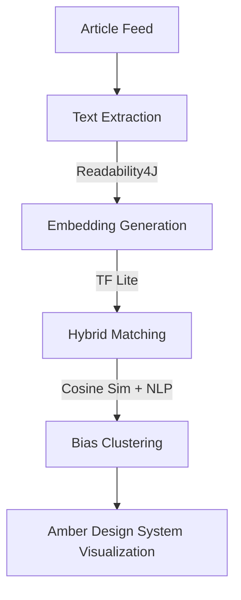
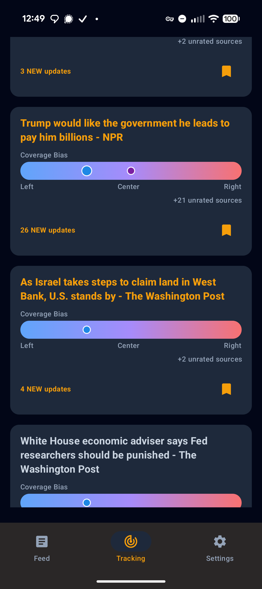
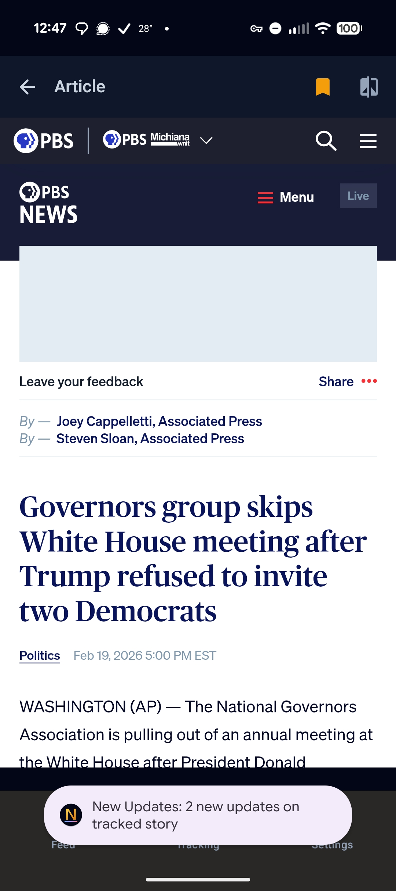
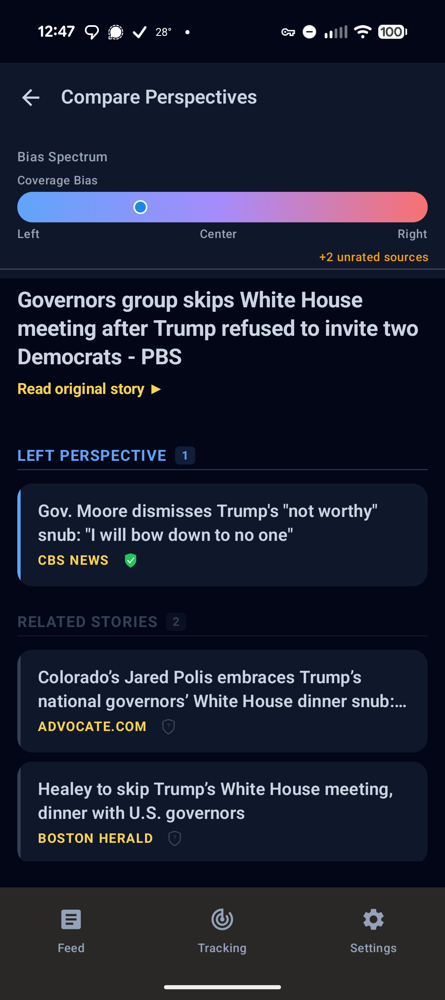

# NewsThread 🧵

**Follow the thread of every story**

> [!IMPORTANT]
> **Sign up at [NewsThread.io](https://newsthread.io)** to be notified when the app officially launches!

A native Android news reader that shows how different media sources cover the same story, plotted along a political bias spectrum. Built with an offline-first, privacy-first design, and all processing happens on your device.

---

## What Makes NewsThread Different ✨

### Bias-Aware News Reading ⚖️
- **Integrated bias ratings** on every article from three respected organizations
- Visual indicators showing Left (◄◄), Center-Left (◄), Center (●), Center-Right (►), Right (►►)
- Reliability ratings (1-5 stars) from trusted fact-checking organizations
- 50+ major news sources rated and categorized

### Perspective Comparison 🔍
Compare how sources across the political spectrum cover the same story. Inspired by Google News "Full Coverage" but with a bias transparency layer: articles are plotted along a continuous left-to-right spectrum so you can see where each source falls.

### On-Device NLP Matching 🧠
The matching engine uses TensorFlow Lite sentence embeddings running entirely on your device. No backend server, no data leaves your phone. The app extracts article text, generates semantic embeddings (384-dimensional vectors), and finds genuinely related stories — replacing keyword-based matching with real semantic understanding.

### Privacy-First Design 🛡️
- All processing happens on-device (no backend server)
- No tracking, no ads, no data selling
- Works offline with cached articles
- Future: data backed up to your own Google Drive

---

## Current Status 🚀

**Version**: 1.1.0 (Beta) → 1.2.0 in development
**Status**: Milestone v1.1 Complete ✅ — Currently in **Phase 16: Identity & Store Assets** 🎨

### What's Built

| | Feature | Description |
|---|---------|-------------|
| 📰 | **News Feed** | Live headlines with bias ratings and reliability stars — powered by a custom Cloudflare edge worker |
| 🧠 | **On-Device NLP** | TF Lite sentence embeddings for semantic article matching — no data leaves your device |
| ⚖️ | **Bias Spectrum** | Articles plotted on a continuous left-to-right political axis with heatmap visualization |
| 📌 | **Story Tracking** | Follow developing stories — new articles auto-cluster into tracked threads |
| 🔔 | **Notifications** | Background alerts when tracked stories get new coverage, with deep linking |
| 🎨 | **Amber Design System** | New visual language, consistent design tokens, and polished UI across all screens |
| 🔄 | **Background Sync** | WorkManager pre-computes matches during idle with configurable sync strategies |
| 📖 | **Text Extraction** | Full article body parsed from URLs using Readability4J + JSoup |

<details>
<summary><b>📋 Development History (15+ phases completed)</b></summary>

| Phase | Name | Completed | Highlights |
|-------|------|-----------|------------|
| 1 | Foundation | 2026-02-02 | Room caching, rate limiting, offline-first architecture |
| 2 | Text Extraction | 2026-02-05 | Readability4J article parsing, paywall detection, WiFi-only fetching |
| 3 | Embedding Engine | 2026-02-06 | TF Lite 2.17.0, all-MiniLM-L6-v2 quantized model, 384-dim embeddings |
| 4 | Similarity Matching | 2026-02-06 | Cosine similarity, tiered matching, 100% test coverage |
| 5 | Pipeline Integration | 2026-02-06 | End-to-end matching orchestration, contextual UI hints |
| 6 | Background Processing | 2026-02-07 | WorkManager pre-computation, sync strategy settings |
| 7 | UI Implementation | 2026-02-07 | Bias spectrum visualization, reliability badges |
| 8 | Tracking Foundation | 2026-02-08 | Story tracking database, tracking UI, bookmark controls |
| 9 | Story Grouping | 2026-02-08 | Auto-clustering, novelty detection, perspective tracking |
| 9.5 | Quality & Stability | 2026-02-16 | Hybrid matching (embedding + entity overlap), threshold tuning |
| 10 | Notifications | 2026-02-18 | System notifications, deep linking, article highlighting |
| 10.1 | UI Polish | 2026-02-19 | Source badges, refresh logic, notification suppression |
| 11 | UI/UX Refinement | 2026-02-19 | Design tokens, priority bias heatmap, visual consistency |
| 12 | Architecture Refactor | 2026-02-20 | Domain logic extraction, Hilt DI cleanup, UseCases |
| 13 | UI Design Refresh | 2026-02-20 | Amber Brand identity, editorial shields, UI softening |
| 13.1 | App Icon Refresh | 2026-02-21 | Adaptive icon gradients, mirroring and scaling fixes |
| 13.1.1 | Visual Parity | 2026-02-21 | ArticleCard footer, typography, metrics styling |
| 13.1.2 | Visual Bug Fixes | 2026-02-21 | Deep-link offsets, sticky headers, layout padding |
| 14 | RSS Migration | 2026-02-21 | Replaced NewsAPI with free, unlimited two-layer on-device RSS system |
| 15 | Cloudflare Backend | 2026-02-22 | Serverless edge backend for feed fetching & Google News proxy rendering |

Full details in [ROADMAP.md](.planning/ROADMAP.md).

</details>

---

## 🚀 The Core Engine Is Complete

> NewsThread has officially cut the API cord.

### Phase 14 & 15: The Cloudflare RSS Engine 🌐 ⚡

Until now, NewsThread relied on [NewsAPI](https://newsapi.org) — a fantastic service, but one that comes with rate limits, cost at scale, and a single point of dependency. That changed entirely in Phases 14 & 15.

**We replaced NewsAPI with a free, unlimited, two-layer RSS system covering 46 curated news outlets across the full political spectrum, powered by a Cloudflare Edge Worker.**

**Layer 1 — Google News RSS (Discovery)**
Google News aggregates thousands of sources in real time. NewsThread taps their public RSS feeds to discover what's actually trending — no API key, no quota, no cost. Nine category feeds (Top Stories, World, US, Business, Tech, Health, Science, Sports, Entertainment) plus keyword search.

**Layer 2 — Direct Outlet Feeds (Depth)**
46 handpicked outlets, rated and mapped by political bias, polled directly via RSS. From The Nation and Daily Kos on the left, to AP and Reuters in the center, to The Daily Wire and Newsmax on the right — the full spectrum, not just whatever NewsAPI happens to return.

| Bias | Outlets |
|------|---------|
| ◄◄ Left | MSNBC, The Guardian, The Atlantic, Vox, Slate, HuffPost + more |
| ◄ Lean Left | CNN, NYT, NPR, Washington Post, NBC, ABC, CBS, Politico + more |
| ● Center | AP, Reuters, BBC, The Hill, PBS NewsHour, AllSides, Ground News + more |
| ► Lean Right | WSJ, Fox News, Washington Examiner, National Review, The Dispatch + more |
| ►► Right | Breitbart, The Daily Wire, The Federalist, Newsmax, OAN + more |

**Edge Computing with Cloudflare Workers**
The new Worker resolves Google News redirect links server-side, leverages Cloudflare KV caching for fast response times, mitigates bot-challenges, and standardizes feed parsing into a clean interface.

Critically, this is **fully consistent with NewsThread's privacy-first design**. The Worker is a stateless public content proxy — it has no concept of users, stores no personal data, and serves the same cached response to everyone. Your reading history, tracked stories, and preferences never leave your device.

### Planned (Future Milestones)

- [ ] ⏳ Timeline visualization — see how a story evolves hour by hour
- [ ] 🔑 Google Sign-In and Google Drive backup for your tracked stories
- [ ] 📊 Reading analytics — understand your own media diet
- [ ] ⚠️ Filter bubble warnings when your reading habits skew one-sided
- [ ] 🖱️ Interactive bias spectrum (tap to filter by political lean)

---

## Key Technical Decisions ⚙️

| Decision | Rationale |
|----------|-----------|
| 🔒 **On-device NLP only** | Privacy-first — all data stays on your device |
| 🌐 **Two-layer RSS (Phase 14)** | Google News for discovery + 46 direct outlet feeds for depth — free, unlimited, no API keys |
| 🤖 **TF Lite with all-MiniLM-L6-v2** | 2.17.0+ quantized model for 16KB alignment |
| ⚡ **Pre-compute matches** | Results ready before user taps Compare |
| 🎨 **Bias spectrum UI** | Continuous axis is more nuanced than buckets |
| ✂️ **Readability4J + JSoup** | Parse article body from URLs with fallback |
| 📐 **In-memory cosine similarity** | Fast and lightweight for mobile |
| 📶 **User-controlled fetching** | WiFi-only / always / never setting |
| 🧱 **16KB Page Alignment** | Android 15 compatibility |

---

## Architecture 🏗️

### Clean Architecture Layers

```
presentation/         # UI layer (Jetpack Compose)
├── feed/             # News feed with bias ratings
├── detail/           # Article detail WebView
├── comparison/       # Perspective comparison (bias spectrum)
├── tracking/         # Story tracking & thread management
├── story/            # Story detail view
├── components/       # Shared UI components (BiasHeatmap, etc.)
├── navigation/       # Bottom nav bar & route definitions
├── settings/         # App settings
└── theme/            # Material 3 theming

domain/               # Business logic (pure Kotlin)
├── model/            # Domain models (Article, SourceRating, etc.)
├── usecase/          # Business logic use cases
└── repository/       # Repository interfaces

data/                 # Data layer
├── local/            # Room database, DAOs, entities
├── remote/           # Retrofit API, DTOs
└── repository/       # Repository implementations

di/                   # Hilt dependency injection modules
util/                 # Utilities (DatabaseSeeder, etc.)
```

### Tech Stack

- **UI**: Jetpack Compose with Material Design 3
- **Architecture**: MVVM + Clean Architecture
- **DI**: Hilt (Dagger)
- **Database**: Room (SQLite) with proper migrations
- **Networking**: Retrofit + OkHttp with caching
- **Image Loading**: Coil
- **Async**: Kotlin Coroutines + Flow
- **Navigation**: Jetpack Navigation Compose
- **ML**: TensorFlow Lite with all-MiniLM-L6-v2 for on-device sentence embeddings
- **Text Extraction**: Readability4J + JSoup
- **Background**: WorkManager with Hilt integration
 
### Tooling & AI-Augmentation 🤖

NewsThread was built using a hybrid AI-augmented workflow, moving from foundational boilerplate to complex architectural engineering.

* **[Android Studio](https://developer.android.com/studio)**: The primary forge for development.
* **[Antigravity](https://antigravity.google/)**: The agentic partner for complex phases (Orchestration, on-device NLP, and 16KB system fixes).
* **[Claude Code](https://claude.ai/code)**: The foundational spark used for initial prototyping and Phase 1-2 UI/Repository boilerplate.
* **[GSD (Getting Shit Done)](https://github.com/gsd-build/get-shit-done)**: The workflow framework providing structured research, planning, and execution cycles.
* **[Beads](https://github.com/steveyegge/beads)**: Local system management and daemon integration.
 
### Matching Pipeline


```mermaid
graph TD
    A[Article Feed] --> B[Text Extraction]
    B -->|Readability4J| C[Embedding Generation]
    C -->|TF Lite| D[Hybrid Matching]
    D -->|Cosine Sim + NLP| E[Bias Clustering]
    E --> F[Amber Design System Visualization]
```

---

## Source Bias Rating System 📊

> **Disclaimer**
>
> Bias ratings are provided for **informational and educational purposes only**. These ratings aggregate data from third-party organizations and represent general consensus, not absolute truth. Individual articles may vary from a source's overall rating. We encourage reading from multiple sources and thinking critically.

NewsThread uses a **consensus approach** combining three respected media bias organizations:

### Rating Sources
1. **AllSides**: Community-driven bias ratings
2. **Ad Fontes Media**: Interactive Media Bias Chart
3. **Media Bias/Fact Check**: Detailed factual reporting analysis

### Bias Scale
- **-2 (◄◄)**: Left — CNN, MSNBC, HuffPost
- **-1 (◄)**: Center-Left — NPR, Washington Post, Politico
- **0 (●)**: Center — Reuters, AP, BBC, The Hill
- **+1 (►)**: Center-Right — WSJ (news), The Economist
- **+2 (►►)**: Right — Fox News, Breitbart, Newsmax
- **?**: **Unrated Perspectives** — Sources not yet rated appear with a question mark; they are still matched and clustered, but without a bias position.

### Reliability Scale (1-5 stars)
- **★★★★★**: Very High — Reuters, AP, BBC
- **★★★★☆**: High — NPR, WSJ, Washington Post
- **★★★☆☆**: Mostly Factual — CNN, Fox News
- **★★☆☆☆**: Mixed — Opinion sites, partisan sources
- **★☆☆☆☆**: Low — Conspiracy sites, misinformation

50+ sources rated including CNN, Fox News, MSNBC, Reuters, AP, BBC, NPR, New York Times, Washington Post, Wall Street Journal, The Guardian, Politico, The Hill, Bloomberg, and more.

---

## Getting Started 🛠️

### Prerequisites
- Android Studio Hedgehog or newer
- Android SDK 34
- Kotlin 1.9+
- ~~NewsAPI key~~ *(Phase 14 removes this requirement — no API keys needed)*

### Setup

1. **Clone the repository**
   ```bash
   git clone https://github.com/lweiss01/news-thread.git
   cd news-thread
   ```

2. **~~Add API key~~** *(Removed in Phase 14 — no API keys needed!)*
   ~~Create `secrets.properties` in the project root:~~
   ```text
   ~~NEWS_API_KEY=your_key_here~~
   ```

3. **Build and run**
   ```bash
   gradlew assembleDebug
   ```
   Or open in Android Studio, sync Gradle, and run on emulator or device.

---

## Screenshots 📸
 
<table>
  <tr>
    <td width="33%" align="center">
      
      <br><b>Tracked Stories</b><br>
      Follow developing stories with auto-clustered updates.
    </td>
    <td width="33%" align="center">
      
      <br><b>Live Updates & Notifications</b><br>
      Get instantly notified when new perspectives are added to stories you track.
    </td>
    <td width="33%" align="center">
      
      <br><b>Compare Perspectives</b><br>
      Semantic matching along a political bias spectrum.
    </td>
  </tr>
</table>

---

## Configuration

- **Min SDK**: 26 (Android 8.0)
- **Target SDK**: 34 (Android 14)
- **Java**: 17
- **Kotlin**: 1.9.22

Firebase requires a valid `google-services.json` in `app/` (not committed to git).

---

## Contributing

Not yet accepting contributions as this is early-stage development. Check back later!

---

## License

Copyright © 2026 Lisa Weiss. All rights reserved. See [LICENSE](LICENSE) for details.

---

## About

Built by a senior information security data analyst who believes we need better tools to navigate today's complex media landscape. NewsThread helps people read news from diverse perspectives and understand the full story.

**Links:**
- **Repository**: https://github.com/lweiss01/news-thread
- **Issues**: https://github.com/lweiss01/news-thread/issues

---

**[Join the Waitlist](https://newsthread.io)**: Be the first to know when the app launches.

---

**"Follow the thread of every story"**
